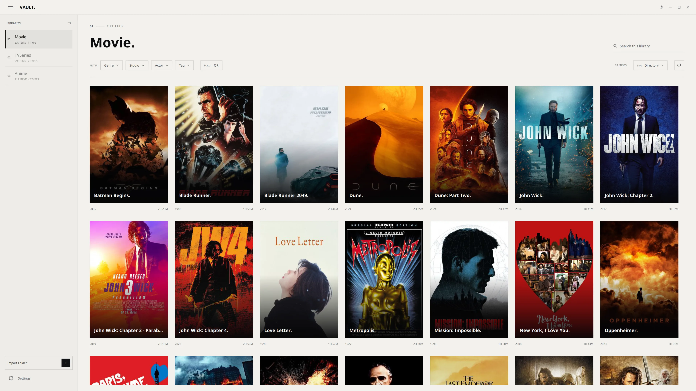

<p align="center">
  
</p>

<h1 align="center">Vault</h1>

<p align="center">
  Browse scraped Kodi-style movies, TV shows, and comics.
</p>

<p align="center">
  <a href="https://github.com/zluo01/Vault/actions/workflows/main.yml"></a>
  
  <a href="LICENSE"></a>
</p>

## Introduction

Simple desktop application for browsing movies, TV shows, and comics scraped with Kodi-compatible metadata.

## Preview

<p align="center">
  <picture>
    <source media="(prefers-color-scheme: dark)" srcset="assets/screenshots/dark.webp">
    <source media="(prefers-color-scheme: light)" srcset="assets/screenshots/light.webp">
    
  </picture>
</p>

## Installation

### Prebuilt packages

Download the package for your platform from [GitHub Releases](https://github.com/zluo01/Vault/releases). Release builds include a bundled Java runtime, so a separate Java installation is not required.

| Platform | Package | Architecture |
| --- | --- | --- |
| Linux | AppImage | x86_64 |
| macOS | DMG | Apple Silicon / arm64 |
| Windows | MSI installer | x86_64 |

#### Linux

Make the downloaded AppImage executable, then run it:

```bash
chmod +x Vault-*.AppImage
./Vault-*.AppImage
```

## Development

### Requirements

- JDK 25
- Maven
- Git
- A C build toolchain for the native artwork converter

The native converter bundles WebP and AVIF decoding support. Build it once for your platform before running Maven commands that exercise image conversion.

#### Linux build tools

Debian or Ubuntu:

```bash
sudo apt install build-essential cmake ninja-build pkg-config curl python3-venv
```

Fedora:

```bash
sudo dnf install gcc make cmake ninja-build pkgconf curl python3
```

#### macOS build tools

Install the Xcode command-line tools, CMake, and Python:

```bash
xcode-select --install
brew install cmake python3
```

The Windows native library is currently cross-compiled from Linux with MinGW. CI performs this step for Windows release packages.

### Build and run

```bash
# Linux
./native/build-linux.sh

# macOS: use ./native/build-mac.sh instead
mvn javafx:run
```

### Tests and code quality

```bash
# Check formatting, Checkstyle, compilation, and tests
mvn verify

# Apply the configured Java formatter
mvn spotless:apply
```

Java sources are formatted with Google Java Format. `mvn verify` runs Spotless, Checkstyle, compilation, and the JUnit test suite.

### Build a self-contained application

Build the native converter first, then create the platform application image:

```bash
mvn verify -Papp -DskipTests
```

The output is written to `target/dist/`.

To turn the Linux application image into an AppImage, install `appimagetool` or `linuxdeploy`, then run:

```bash
./scripts/package-appimage.sh
```

The AppImage is written to `target/appimage/`.

### Local application data

Vault stores its database, cached covers, and logs in the platform's standard application-data location:

- Linux: `$XDG_DATA_HOME/vault`, or `~/.local/share/vault` when `XDG_DATA_HOME` is not set
- macOS: `~/Library/Application Support/vault`
- Windows: `%APPDATA%\vault`

## License

Vault is distributed under the [GNU General Public License v3.0](LICENSE).
